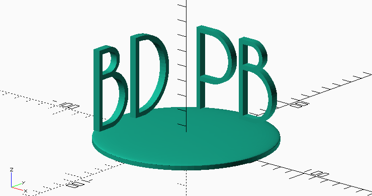
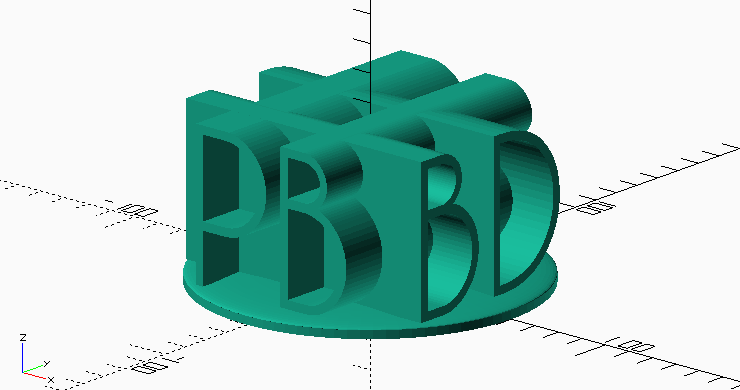
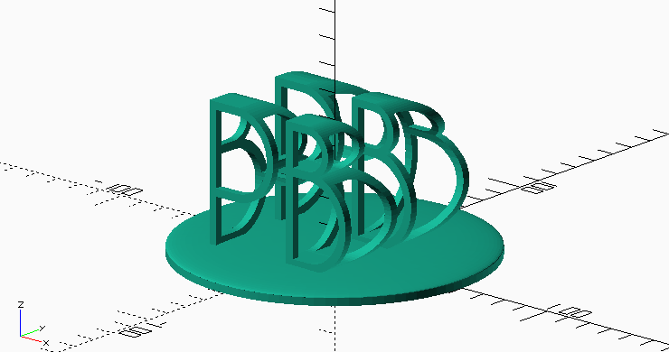
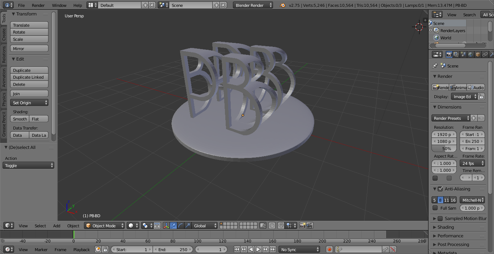
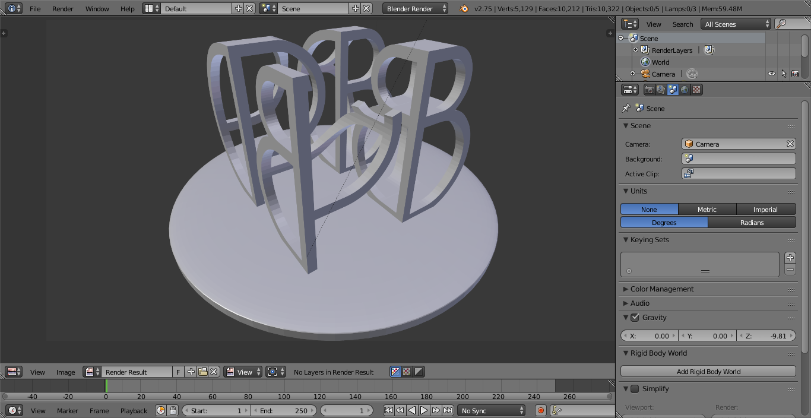

What this is about
------------------

[OpenSCAD](http://openscad.org).


Implementation in OpenSCAD
--------------------------

The OpenSCAD [documentation](http://www.openscad.org/documentation.html)

### Placing the Letters

``` {.c}
// Global variable which influences the resolution of the mesh
$fn = 60; 

// Constants for our geometry
font = "Caviar Dreams";
letter_size = 50;
letter_height = 5;
hoffset = 50;
voffset = 6 + letter_size/2;

module letter(l) {
  // Use linear_extrude() to make the letters 3D objects as they
  // are only 2D shapes when only using text()
  linear_extrude(height = letter_height) {
    text(l, size=letter_size, font=font, halign="center", valign="center");
  }
}

union() {
    // Base plate: Consists of a cylinder at the bottom and a flattened 
    // sphere at qthe top
    linear_extrude(height=3) {
        circle(60, $fn=1.5*$fn);
    };
    translate([0,0,3]) resize([120,120,2*3]) sphere($fn=1.5*$fn);
    // Actual intersection of the letters
    union() {
        translate([0,hoffset,voffset]) rotate([90,0,0])   letter("PB");
        translate([-hoffset,0,voffset]) rotate([90,0,90]) letter("BD");
    }   
}
```


<div class="text-center">**Before extrusion.**</div>

### Extruding the Letters

```  {.c}
// Global variable which influences the resolution of the mesh
$fn = 60; 

// Constants for our geometry
font = "Caviar Dreams";
letter_size = 50;
letter_height = 100;
hoffset = 50;
voffset = 6 + letter_size/2;

module letter(l) {
  // Use linear_extrude() to make the letters 3D objects as they
  // are only 2D shapes when only using text()
  linear_extrude(height = letter_height) {
    text(l, size=letter_size, font=font, halign="center", valign="center");
  }
}

union() {
    // Base plate: Consists of a cylinder at the bottom and a flattened 
    // sphere at qthe top
    linear_extrude(height=3) {
        circle(60, $fn=1.5*$fn);
    };
    translate([0,0,3]) resize([120,120,2*3]) sphere($fn=1.5*$fn);
    // Actual intersection of the letters
    union() {
        translate([0,hoffset,voffset]) rotate([90,0,0])   letter("PB");
        translate([-hoffset,0,voffset]) rotate([90,0,90]) letter("BD");
    }   
}
```


<div class="text-center">**After extrusion.**</div>

### Intersecting the Letters

```  {.c}
// Global variable which influences the resolution of the mesh
$fn = 60; 

// Constants for our geometry
font = "Caviar Dreams";
letter_size = 50;
letter_height = 100;
hoffset = 50;
voffset = 6 + letter_size/2;

module letter(l) {
  // Use linear_extrude() to make the letters 3D objects as they
  // are only 2D shapes when only using text()
  linear_extrude(height = letter_height) {
    text(l, size=letter_size, font=font, halign="center", valign="center");
  }
}

union() {
    // Base plate: Consists of a cylinder at the bottom and a flattened 
    // sphere at qthe top
    linear_extrude(height=3) {
        circle(60, $fn=1.5*$fn);
    };
    translate([0,0,3]) resize([120,120,2*3]) sphere($fn=1.5*$fn);
    // Actual intersection of the letters
    intersection() {
        translate([0,hoffset,voffset]) rotate([90,0,0])   letter("PB");
        translate([-hoffset,0,voffset]) rotate([90,0,90]) letter("BD");
    }   
}
```


<div class="text-center">**After intersection.**</div>


"Artistic" Thinning in Blender
------------------------------

<p>

<div class="text-center">**Geometry before thinning.**</div>
</p>

<p>

<div class="text-center">**First part cut off.**</div>
</p>

So after the thinning, the final design looks as follows:

<p>
<div align="center" class="embed-responsive embed-responsive-16by9">
<video class="embed-responsive-item" id="printing-result" width="1920" height="1080" controls src="2015-12-22-openscad-blender-3d-printing/blender.mp4"></video>
</div>
<div class="text-center">**Final geometry after thinning.**</div>
</p>

From this design, I exported the mesh ([STL format](https://en.wikipedia.org/wiki/STL_(file_format))), which I could then send off to ShapeWays for getting back a printed copy!


Final Result
------------

And here goes the proof that the object could actually be printed! (Sorry for the poor video quality.)

<p>
<div align="center" class="embed-responsive embed-responsive-16by9">
<video class="embed-responsive-item" id="printing-result" width="1920" height="1080" controls src="2015-12-22-openscad-blender-3d-printing/printing-result.mp4"></video>
</div>
<div class="text-center">**The 3D-printed beauty!**</div>
</p>

The design was made with parallel lines in mind, i. e., one should look at the object from an infinite distance. This video is partially so jagged because I tried to reproduce this situation: I went a bit further away with the camera and zoomed in. The alternative would have been to construct the object for a certain distance but closer distance, but when are you ever getting really close to shelf to look at an object?


Conclusions
-----------

All in all, I am quite satisfied with the process and the result. I learned how to use OpenScad along the way, refreshed my Blender foo, and now we have a nice geeky PB-BD at home to show to anybody who comes and visits -- willingly or not!


Todo
----

* Format code in C
* Find links for blender, openscad (and wiki)
* shapeways
* Insert examples
