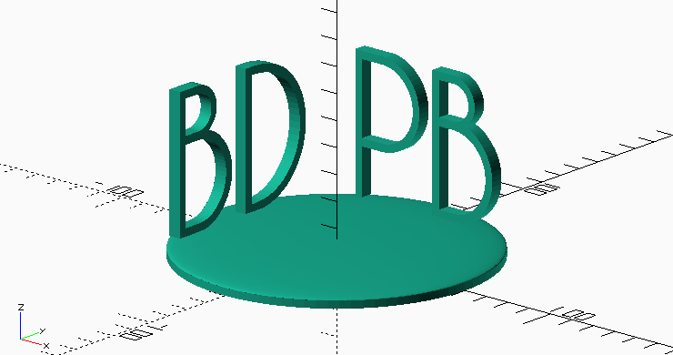

What This Is About
------------------

For our wedding (so long ago already!) we got a nice voucher from good friends to create a custom 3D printed object, and now it was about time we did something about it! So this post is about the voucher, or rather the object that we made with it.

We had many different ideas for things we could print out, but in the end we found the idea of a perspective sculpture interesting. There are already many interesting examples online, like this [Yes/No sculpture](https://imgur.com/gallery/ndP8IQX) or these [animals](https://imgur.com/KezAIUF). To establish a connection to our wedding, we settled on creating a unifying object out of our initials PB-BD. So let's see how that went!


Implementation in OpenSCAD
--------------------------

The core idea of a perspective sculpture is to exploit the perspective from two points of view which are for instance 90° apart from each other. This way, one can perceive two distinct 2D outlines from a single 3D object, depending on the point of view. The 3D object is formed as the intersection of the projection of these two 2D outlines.

To generate this intersection, I used [OpenSCAD](http://openscad.org). OpenSCAD is an open-source application for creating 3D %CAD objects, but instead of being based on a %GUI, the user simply describes the geometry as text in the [OpenSCAD Language](https://en.wikibooks.org/wiki/OpenSCAD_User_Manual/The_OpenSCAD_Language). 

It was the first time that I used OpenSCAD, but apparently it is quite popular for open source hardware projects. It is simple and yet impressive to see [what people can do with it](http://www.openscad.org/gallery.html). The advantages are obvious: Since all designs are described by simple text files, sharing and collaboration is much easier than with a proprietary file format. Or have you ever tried to merge changes from two people into one 3D object in tools like Autodesk Inventor? Also, the OpenSCAD Language allows designs to be parameterized, so properties can be updated by simply changing some variables.

The PB-BD object was actually a pretty simple object to create in OpenSCAD. The steps are basically:

1. Create a first 2D outline (PB).
2. Extrude the outline.
3. Create a second 2D outline (BD) on a plane which is rotated 90° with respect to the first drawing plane.
4. Extrude the second object.
5. Derive the intersection.

This process is described in the following three sections. (Have a look at the [OpenSCAD documentation](http://www.openscad.org/documentation.html) to follow along if you want.)


### Placing the Letters

``` {.c}
// Global variable which influences the resolution of the mesh
$fn = 60; 

// Constants for our geometry
font = "Caviar Dreams";
letter_size = 50;
letter_height = 5;
hoffset = 50;
voffset = 6 + letter_size/2;

module letter(l) {
  // Use linear_extrude() to make the letters 3D objects as they
  // are only 2D shapes when only using text()
  linear_extrude(height = letter_height) {
    text(l, size=letter_size, font=font, halign="center", valign="center");
  }
}

union() {
    // Base plate: Consists of a cylinder at the bottom and a flattened 
    // sphere at qthe top
    linear_extrude(height=3) {
        circle(60, $fn=1.5*$fn);
    };
    translate([0,0,3]) resize([120,120,2*3]) sphere($fn=1.5*$fn);
    // Actual intersection of the letters
    union() {
        translate([0,hoffset,voffset]) rotate([90,0,0])   letter("PB");
        translate([-hoffset,0,voffset]) rotate([90,0,90]) letter("BD");
    }   
}
```


<div class="text-center">**Before extrusion.**</div>

### Extruding the Letters

```  {.c}
// Global variable which influences the resolution of the mesh
$fn = 60; 

// Constants for our geometry
font = "Caviar Dreams";
letter_size = 50;
letter_height = 100;             // <<-- Increased letter_height
hoffset = 50;
voffset = 6 + letter_size/2;

module letter(l) {
  // Use linear_extrude() to make the letters 3D objects as they
  // are only 2D shapes when only using text()
  linear_extrude(height = letter_height) {
    text(l, size=letter_size, font=font, halign="center", valign="center");
  }
}

union() {
    // Base plate: Consists of a cylinder at the bottom and a flattened 
    // sphere at qthe top
    linear_extrude(height=3) {
        circle(60, $fn=1.5*$fn);
    };
    translate([0,0,3]) resize([120,120,2*3]) sphere($fn=1.5*$fn);
    // Actual intersection of the letters
    union() {
        translate([0,hoffset,voffset]) rotate([90,0,0])   letter("PB");
        translate([-hoffset,0,voffset]) rotate([90,0,90]) letter("BD");
    }   
}
```


<div class="text-center">**After extrusion.**</div>

### Intersecting the Letters

```  {.c}
// Global variable which influences the resolution of the mesh
$fn = 60; 

// Constants for our geometry
font = "Caviar Dreams";
letter_size = 50;
letter_height = 100;
hoffset = 50;
voffset = 6 + letter_size/2;

module letter(l) {
  // Use linear_extrude() to make the letters 3D objects as they
  // are only 2D shapes when only using text()
  linear_extrude(height = letter_height) {
    text(l, size=letter_size, font=font, halign="center", valign="center");
  }
}

union() {
    // Base plate: Consists of a cylinder at the bottom and a flattened 
    // sphere at qthe top
    linear_extrude(height=3) {
        circle(60, $fn=1.5*$fn);
    };
    translate([0,0,3]) resize([120,120,2*3]) sphere($fn=1.5*$fn);
    // Actual intersection of the letters
    intersection() {     // <<-- Updated from union() to intersection()
        translate([0,hoffset,voffset]) rotate([90,0,0])   letter("PB");
        translate([-hoffset,0,voffset]) rotate([90,0,90]) letter("BD");
    }   
}
```


<div class="text-center">**After intersection.**</div>


"Artistic" Thinning in Blender
------------------------------

The fascinating idea about perspective sculptures is that you cannot really guess what the object is supposed to be before you have not seen it from the right direction. For this, the OpenSCAD version of the PB-BD still looked to "clean", so I wanted to remove parts which are not necessary to generate the PB-BD. After all, seen from one direction only one line needs to remain to create the 2D outline.

Describing this thinning process in the OpenSCAD language would have been tedious, so instead I took the OpenSCAD-generated mesh and imported it into [Blender](https://www.blender.org/), another open-source program for 3D modelling.

After the import in Blender, the sculpture obviously still looked like in OpenSCAD.

<p>

<div class="text-center">**Geometry before thinning.**</div>
</p>

Now I started to manually chop off different parts …

<p>

<div class="text-center">**First part cut off.**</div>
</p>

… to eventually arrive at the final design:

<p>
<div align="center" class="embed-responsive embed-responsive-16by9">
<video class="embed-responsive-item" id="printing-result" width="1920" height="1080" controls src="2016-03-06-openscad-blender-3d-printing/blender.mp4"></video>
</div>
<div class="text-center">**Final geometry after thinning.**</div>
</p>

The result was pleasing, and it was time to actually order the 3D printed object from [Shapeways](http://www.shapeways.com/). For that, I exported the mesh in the common [STL format](https://en.wikipedia.org/wiki/STL_(file_format)) and uploaded it on the Shapeways website.

Now that this was done, all that remained to do was to wait!


Final Result
------------

About two weeks later we finally got our package. We are quite pleased with the result! Here goes the proof that the object could actually be printed! (Sorry for the poor video quality.)

<p>
<div align="center" class="embed-responsive embed-responsive-16by9">
<video class="embed-responsive-item" id="printing-result" width="1920" height="1080" controls src="2016-03-06-openscad-blender-3d-printing/printing-result.mp4"></video>
</div>
<div class="text-center">**The 3D-printed beauty!**</div>
</p>

The design was made with parallel lines in mind, i. e., one should look at the object from an infinite distance. This video is partially so jagged because I tried to reproduce this situation: I went a bit further away with the camera and zoomed in. The alternative would have been to construct the object for a certain but closer distance, but when are you ever getting really close to a shelf to look at an object?


Conclusions
-----------

All in all, I am quite satisfied with the process and the result. I learned how to use OpenScad along the way, refreshed my Blender foo, and now we have a nice geeky PB-BD sculpture at home to show to anybody who comes and visits -- whether they want to see it or not :-)
